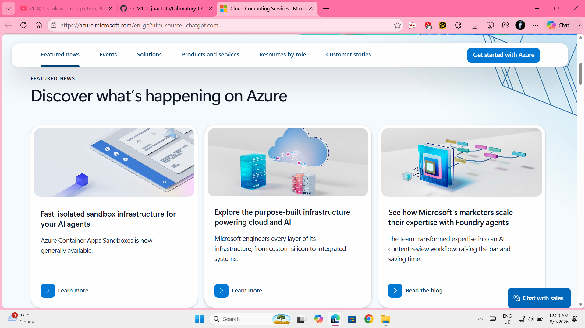

# Microsoft Azure Research

## Brief Overview

Microsoft Azure is a cloud computing platform provided by Microsoft. It offers services for computing, storage, networking, databases, security, artificial intelligence, and other technology needs. Organizations can use Azure to build, deploy, and manage applications and cloud resources.

## Global Infrastructure

Microsoft Azure has a global infrastructure made up of regions and datacenters located around the world. Azure currently has more than 80 regions and more than 500 datacenters. Its global infrastructure helps organizations deploy applications and services closer to their users.

## Cloud Management Console

The Azure portal is a web-based management interface for Microsoft Azure. It allows users to create, configure, monitor, and manage Azure services and cloud resources through a graphical interface.

## Four Core Services

### Azure Virtual Machines
Azure Virtual Machines provides virtual computing resources in the cloud. Organizations can use virtual machines to run applications, operating systems, and different workloads.

### Azure Blob Storage
Azure Blob Storage is an object storage service designed for storing large amounts of unstructured data such as files, images, documents, and backups.

### Azure Virtual Network
Azure Virtual Network allows users to create private virtual networks in Azure. It helps cloud resources communicate securely with each other and with other networks.

### Microsoft Entra ID
Microsoft Entra ID is Microsoft's cloud-based identity and access management service. It helps organizations manage identities and control access to applications and resources.

## Three Advantages

1. **Microsoft Integration** - Azure integrates with many Microsoft technologies and services used by organizations.
2. **Global Infrastructure** - Azure provides regions and datacenters in many locations around the world.
3. **Scalability** - Organizations can adjust Azure resources as their computing and business requirements change.

## Typical Enterprise Use Cases

Enterprises can use Azure for hosting applications, running virtual machines, storing data, managing identities, creating cloud networks, supporting hybrid environments, and moving existing business systems to the cloud. 

## Screenshot Evidence

