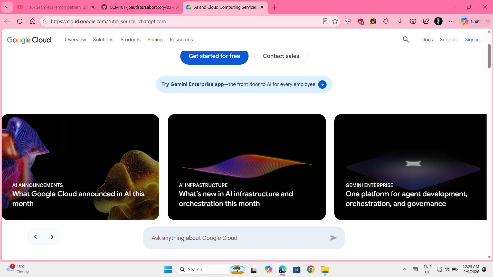

# Google Cloud Platform Research

## Brief Overview

Google Cloud is a cloud computing platform provided by Google. It offers services for computing, storage, networking, databases, artificial intelligence, data analytics, and other technology needs. Organizations can use Google Cloud to build, deploy, and manage applications and cloud resources.

## Global Infrastructure

Google Cloud operates a global infrastructure made up of regions and zones. Regions are independent geographic areas, while zones are isolated locations within regions. Google Cloud currently has 43 regions and 130 zones around the world.

## Cloud Management Console

The Google Cloud console is a web-based interface for accessing and managing Google Cloud services and resources. It allows users to create, configure, monitor, and manage cloud resources through a graphical interface.

## Four Core Services

### Compute Engine
Compute Engine provides virtual machines that organizations can use to run applications and workloads in Google Cloud.

### Cloud Storage
Cloud Storage is an object storage service used to store and manage data such as files, images, backups, and application content.

### Virtual Private Cloud
Virtual Private Cloud (VPC) provides networking capabilities for Google Cloud resources. It allows organizations to create and manage virtual networks for their cloud environments.

### Cloud IAM
Cloud Identity and Access Management (IAM) helps organizations control access to Google Cloud resources using roles and permissions.

## Three Advantages

1. **Global Infrastructure** - Google Cloud provides regions and zones in different locations around the world.
2. **Data and AI Capabilities** - Google Cloud provides technologies and services for data analytics, artificial intelligence, and machine learning.
3. **Scalability** - Organizations can adjust their cloud resources based on changing workloads and business requirements.

## Typical Enterprise Use Cases

Enterprises can use Google Cloud for hosting applications, running virtual machines, storing data, supporting data analytics and artificial intelligence workloads, managing cloud networks, and deploying scalable applications.

## Screenshot Evidence

